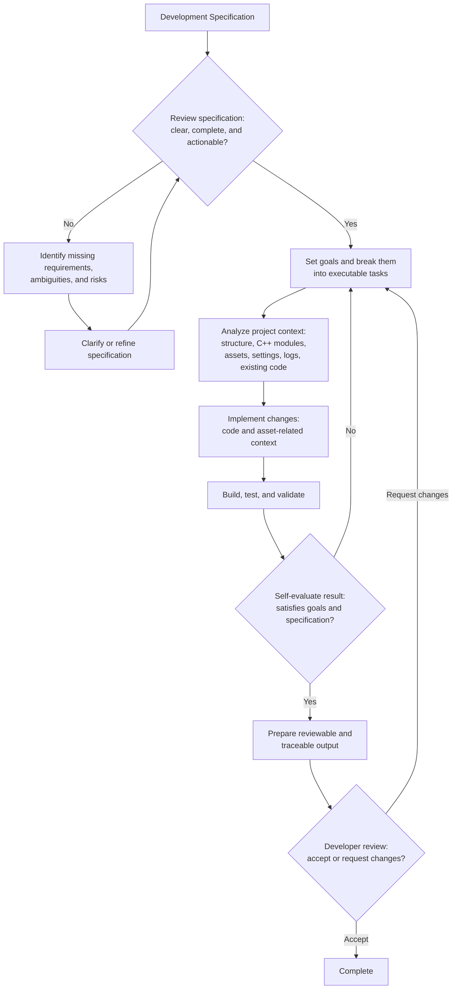

# ue-agent-toolkit

## Overview

**ue-agent-toolkit** is a toolkit for AI-agentic workflow for Unreal Engine projects.

This repository contains agent instructions, skills, specialized agents, and Unreal Engine plugins designed for game development mainly using C++.

For asset inspection/editing, PIE control, Automation, logs, captures, and structured evidence, the toolkit connects directly to Unreal Engine's local MCP server. The bundled `UnrealMCPToolsets` plugin enables the required engine toolset stack and adds project-specific toolsets.

It is not a standalone Unreal project; install it as a Claude Code plugin and use it with your existing Unreal project.

This branch is for Claude Code users. If you use another AI agent tool, check the corresponding branch:

- [Codex](https://github.com/Tractatuz/ue-agent-toolkit/tree/codex)
- [OpenCode](https://github.com/Tractatuz/ue-agent-toolkit/tree/opencode)

## Requirements

- Claude Code (CLI, desktop app, or IDE extension) with plugin support.
- Python 3 is required for the installer and Ralph Loop helper scripts.
- `UnrealMCPToolsets` requires Unreal Engine 5.8 and its experimental Unreal MCP/toolset plugins.

## Installation

1. Clone this branch and add it as a Claude Code plugin marketplace.

```bash
git clone -b claude https://github.com/Tractatuz/ue-agent-toolkit.git
```

Then, in Claude Code:

```text
/plugin marketplace add ./ue-agent-toolkit
```

2. Install the plugin with `/plugin install ue-agent-toolkit@ue-agent-toolkit`, or run `/plugin` and pick `ue-agent-toolkit` from the menu.

3. Start a new Claude Code session in your Unreal project root.

4. Ask Claude to install the bundled Unreal plugin. The toolkit's subagents ship with the plugin and need no separate install step.

```text
Use /ue-agent-toolkit:install-ue-plugins to install the bundled Unreal Engine plugin into this Unreal project.
```

5. Enable `UnrealMCPToolsets` in Unreal Editor. It enables the core `EnhancedInput`, `ModelContextProtocol`, `ToolsetRegistry`, and `EditorToolset` dependencies. Review and explicitly enable `PythonScriptPlugin` for Python-based EditorToolset operations, plus optional `AutomationTestToolset`, `SlateInspectorToolset`, and `UMGToolSet` only for workflows that need them. Then rebuild the editor target and any optional Toolset whose binaries do not match the current editor.

6. Start the Unreal MCP server from the engine setting or launch the editor with `-ModelContextProtocolStartServer`. The toolkit connects to `http://127.0.0.1:8000/mcp` by default.

7. Start a new Claude Code session so the plugin MCP connection and bundled subagents are loaded. The agents discover live schemas with `list_toolsets` and `describe_toolset` before calling tools.

### Updating The Bundled Unreal Plugin

Pull the marketplace clone to refresh the bundled payload. A SessionStart hook then compares the payload
`.uplugin` version with the copy installed in the project and reports drift; it never edits project files.
Because the plugin is source-only, applying an update requires re-running the install skill with approval,
then rebuilding the editor target and restarting the editor.

## Why ue-agent-toolkit?

Unreal Engine projects are hard to work with using general AI agent workflows because of **large engine codebase**, **long compile time**, and **dependency on non-text asset files**.

So AI agents need Unreal-specific tools and workflows to develop effectively.

ue-agent-toolkit provides Unreal-specific foundations for AI-agentic development.

## Project Goal

The goal of ue-agent-toolkit is to make AI agents capable of performing real development tasks in Unreal Engine projects with less human intervention.

Specifically, this project aims to:

- understand Unreal Engine project structure
- work with both code and asset-related project context
- evaluate the quality of their own work
- collaborate with developers through reviewable and traceable outputs

The long-term goal of ue-agent-toolkit is to support fully autonomous development loops for Unreal Engine projects, inspired by Ralph Loop style agent workflows.

## Expected Workflow



## Roadmap

This roadmap is not fixed and may change as the project is updated.

Planned areas of development include:

- Expand Unreal-specific agent instructions for project analysis, C++ development, validation, and review
- Expand reusable skills for common Unreal Engine development tasks
- Improve specialized skills for test, validation, and result evaluation
- Improve workflows for evaluating development specifications before implementation
- Improve workflows for turning development goals into executable agent tasks
- Improve validation support for build results, test results, logs, and runtime behavior
- Improve Unreal plugins for analysis, development, and testing

---
## Components

### Skills

#### install-ue-plugins
- Installs the bundled Unreal Engine plugins into an Unreal project's `Plugins` directory.
#### ue-spec
- Creates or reviews Unreal Engine feature specifications before implementation planning.
#### ue-plan		
- Turns an Unreal Engine spec document or implementation goal prompt into a concrete, executable implementation plan.
#### ue-analyze	
- Coordinates Unreal gameplay analysis across C++/config evidence and read-only Unreal MCP asset inspection.
#### ue-implement
- Coordinates Unreal feature implementation across C++/config changes and focused Unreal MCP asset edits.
#### ue-test		
- Coordinates build tests, Unreal MCP Automation/PIE checks, logs/captures, and structured evidence packets.
#### ue-ralph-loop
- Coordinates an end-to-end autonomous Unreal development loop from spec readiness through planning, analysis, implementation, validation, self-evaluation, and reviewable handoff.

### Agents

These ship with the plugin as Claude Code subagents; skills delegate to them by name.

#### ue-code-reader
- Reads Unreal C++ and config evidence for delegated analysis scopes.
#### ue-code-writer
- Implements focused Unreal Engine C++ and config changes for delegated feature scopes.
#### ue-code-reviewer
- Reviews Unreal Engine C++ structure and code changes using source inspection and LSP evidence.
#### ue-asset-scanner
- Inspects Unreal Blueprint and asset evidence with focused editor tooling.
#### ue-asset-editor
- Adds or modifies supported Unreal Engine assets with focused editor tooling.
#### ue-tester
- Runs focused Unreal Engine validation through builds, Unreal Automation, and targeted runtime checks.

### Bundled Unreal Engine Plugin

#### UnrealMCPToolsets
- Enables the engine Unreal MCP toolset stack and adds focused project-specific toolsets.

### Migrated Runtime Paths

- Asset inspection formerly handled by AssetToJson now uses `AssetTools`, `ObjectTools`, `BlueprintTools`, `UMGToolSet`, and specialized MCP toolsets.
- Asset editing formerly handled by JsonToAsset now uses focused type-specific MCP calls with compile, read-back, explicit save, and dirty-state verification.
- Runtime checks formerly handled by TestPlay now use bounded MCP-controlled PIE, the bundled `PlaytestToolset` for Enhanced Input injection, and Automation where appropriate.
- Evidence formerly handled by TaskEvidence now uses `ue.mcp.evidence.v1` packets under `Saved/Agent/Evidence/`, written through Unreal MCP.
