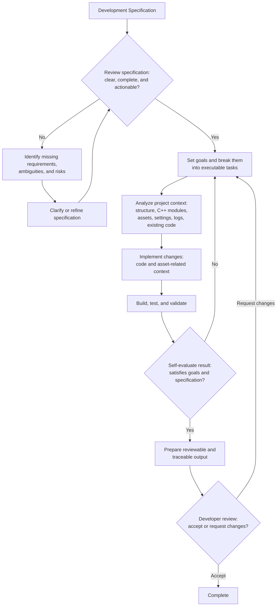

# ue-agent-toolkit

## Overview

**ue-agent-toolkit** is a toolkit for AI-agentic workflow for Unreal Engine projects.

This repository contains agent instructions, skills, specialized agents, and Unreal Engine plugins designed for game development mainly using C++.

For supported asset inspection and editing, the toolkit uses the bundled `UnrealMCPToolsets` plugin through Unreal Engine's `ToolsetRegistry`.

It is not a standalone Unreal project; install it as a Codex plugin and use it with your existing Unreal project.

This branch is for Codex users. If you use another AI agent tool, check the corresponding branch:

- [Claude Code](https://github.com/Tractatuz/ue-agent-toolkit/tree/claude)
- [OpenCode](https://github.com/Tractatuz/ue-agent-toolkit/tree/opencode)

## Requirements

- Codex in the ChatGPT desktop app or Codex CLI with plugin support.
- Python 3 is required for the helper scripts used by skills.
- `UnrealMCPToolsets` requires Unreal Engine 5.8 and the engine `ToolsetRegistry` plugin.

## Installation

1. Add this repository as a Codex plugin marketplace.

```powershell
codex plugin marketplace add Tractatuz/ue-agent-toolkit --ref codex
```

2. Run `/plugins` in Codex CLI, or open Plugins in the desktop app, and install `UE Agent Toolkit`.

3. Start a new Codex task and open your Unreal project root.

4. Ask Codex to install the project-local agents and bundled Unreal plugin.

```text
Use $install-ue-agents to install the bundled custom agents into this Unreal project.
Use $install-ue-plugins to install the bundled Unreal Engine plugin into this Unreal project.
```

5. Enable `ToolsetRegistry` and `UnrealMCPToolsets` in Unreal Editor, then rebuild the editor target.

6. Start a new Codex task so the installed project agents are loaded.

## Why ue-agent-toolkit?

Unreal Engine projects are hard to work with using general AI agent workflows because of **large engine codebase**, **long compile time**, and **dependency on non-text asset files**.

So AI agents need Unreal-specific tools and workflows to develop effectively.

ue-agent-toolkit provides Unreal-specific foundations for AI-agentic development.

## Project Goal

The goal of ue-agent-toolkit is to make AI agents capable of performing real development tasks in Unreal Engine projects with less human intervention.

Specifically, this project aims to:

- understand Unreal Engine project structure
- work with both code and asset-related project context
- evaluate the quality of their own work
- collaborate with developers through reviewable and traceable outputs

The long-term goal of ue-agent-toolkit is to support fully autonomous development loops for Unreal Engine projects, inspired by Ralph Loop style agent workflows.

## Expected Workflow



## Roadmap

This roadmap is not fixed and may change as the project is updated.

Planned areas of development include:

- Expand Unreal-specific agent instructions for project analysis, C++ development, validation, and review
- Expand reusable skills for common Unreal Engine development tasks
- Improve specialized skills for test, validation, and result evaluation
- Improve workflows for evaluating development specifications before implementation
- Improve workflows for turning development goals into executable agent tasks
- Improve validation support for build results, test results, logs, and runtime behavior
- Improve Unreal plugins for analysis, development, and testing

---
## Components

### Skills

#### install-ue-agents
- Installs the bundled Codex custom agents into an Unreal project's `.codex/agents` directory.
#### install-ue-plugins
- Installs the bundled Unreal Engine plugins into an Unreal project's `Plugins` directory.
#### ue-spec
- Creates or reviews Unreal Engine feature specifications before implementation planning.
#### ue-plan		
- Turns an Unreal Engine spec document or implementation goal prompt into a concrete, executable implementation plan.
#### ue-analyze	
- Coordinates Unreal gameplay analysis across C++/config evidence and read-only asset inspection.
#### ue-implement
- Coordinates Unreal feature implementation across C++/config changes and supported asset edits.
#### ue-test		
- Coordinates Unreal Engine validation through build tests, Unreal Automation, and targeted runtime checks.
#### ue-ralph-loop
- Coordinates an end-to-end autonomous Unreal development loop from spec readiness through planning, analysis, implementation, validation, self-evaluation, and reviewable handoff.

### Agents

#### ue-code-reader
- Reads Unreal C++ and config evidence for delegated analysis scopes.
#### ue-code-writer
- Implements focused Unreal Engine C++ and config changes for delegated feature scopes.
#### ue-code-reviewer
- Reviews Unreal Engine C++ structure and code changes using source inspection and LSP evidence.
#### ue-asset-scanner
- Inspects Unreal Blueprint and asset evidence with focused editor tooling.
#### ue-asset-editor
- Adds or modifies supported Unreal Engine assets with focused editor tooling.
#### ue-tester
- Runs focused Unreal Engine validation through builds, Unreal Automation, and targeted runtime checks.

### Bundled Unreal Engine Plugin

#### UnrealMCPToolsets
- Exposes focused asset inspection and editing operations through `ToolsetRegistry`.
