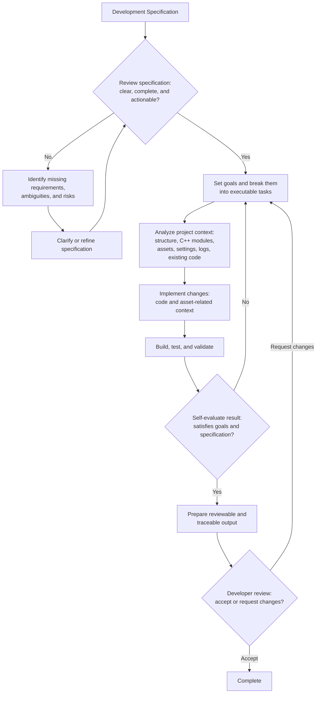

# ue-agent-toolkit

## Overview

**ue-agent-toolkit** is a toolkit for AI-agentic workflow for Unreal Engine projects.

This repository contains agent instructions, skills, specialized agents, and Unreal Engine plugins designed for game development mainly using C++.

It is not a standalone Unreal project; install it into your existing Unreal project.

This branch is for OpenCode users. If you use another AI agent tool, check the corresponding branch:

- [Claude Code](https://github.com/Tractatuz/ue-agent-toolkit/tree/claudecode)
- [Codex](https://github.com/Tractatuz/ue-agent-toolkit/tree/codex)

## Requirements

- Python is required for the helper scripts used by skills.
- To use the Unreal Engine plugins included as submodules, enable Python Remote Execution in the Unreal Editor.

## Installation

Install this toolkit into an existing Unreal Engine project.

1. Clone this repository with submodules.

```bash
git clone --recurse-submodules https://github.com/Tractatuz/ue-agent-toolkit.git
```

If you do not clone with `--recurse-submodules`, the plugin folders will be empty.

2. Copy the cloned files into your Unreal project root.

Your project should include:

```text
YourProject/
  .opencode/
  Plugins/
  YourProject.uproject
```

3. Enable the included plugins in Unreal Editor.

- `TaskEvidence`
- `AssetToJson`
- `JsonToAsset`
- `TestPlay`

4. Enable Python Remote Execution.

`Edit > Project Settings > Plugins > Python > Enable Remote Execution`

5. Run OpenCode from your Unreal project root and Start working!

## Why ue-agent-toolkit?

Unreal Engine projects are hard to work with using general AI agent workflows because of **large engine codebase**, **long compile time**, and **dependency on non-text asset files**.

So AI agents need Unreal-specific tools and workflows to develop effectively.

ue-agent-toolkit provides Unreal-specific foundations for AI-agentic development.

## Project Goal

The goal of ue-agent-toolkit is to make AI agents capable of performing real development tasks in Unreal Engine projects with less human intervention.

Specifically, this project aims to:

- understand Unreal Engine project structure
- work with both code and asset-related project context
- evaluate the quality of their own work
- collaborate with developers through reviewable and traceable outputs

The long-term goal of ue-agent-toolkit is to support fully autonomous development loops for Unreal Engine projects, inspired by Ralph Loop style agent workflows.

## Expected Workflow



## Roadmap

This roadmap is not fixed and may change as the project is updated.

Planned areas of development include:

- Expand Unreal-specific agent instructions for project analysis, C++ development, validation, and review
- Expand reusable skills for common Unreal Engine development tasks
- Improve specialized skills for test, validation, and result evaluation
- Improve workflows for evaluating development specifications before implementation
- Improve workflows for turning development goals into executable agent tasks
- Improve validation support for build results, test results, logs, and runtime behavior
- Improve Unreal plugins for analysis, development, and testing

---
## Components

### Skills

#### ue-spec
- Creates or reviews Unreal Engine feature specifications before implementation planning.
#### ue-plan		
- Turns an Unreal Engine spec document or implementation goal prompt into a concrete, executable implementation plan.
#### ue-analyze	
- Coordinates Unreal gameplay analysis across C++/config evidence and read-only asset inspection.
#### ue-implement
- Coordinates Unreal feature implementation across C++/config changes and JsonToAsset-driven asset edits.
#### ue-test		
- Coordinates Unreal Engine validation through build tests, Unreal Automation, and TestPlay PIE playtests.
#### ue-ralph-loop
- Coordinates an end-to-end autonomous Unreal development loop from spec readiness through planning, analysis, implementation, validation, self-evaluation, and reviewable handoff.

### Agents

#### ue-code-reader
- Reads Unreal C++ and config evidence for delegated analysis scopes.
#### ue-code-writer
- Implements focused Unreal Engine C++ and config changes for delegated feature scopes.
#### ue-code-reviewer
- Reviews Unreal Engine C++ structure and code changes using source inspection and LSP evidence.
#### ue-asset-scanner
- Scans Unreal Blueprint and asset evidence sequentially through AssetToJson helpers.
#### ue-asset-editor
- Adds or modifies Unreal Engine assets sequentially through JsonToAsset.
#### ue-tester
- Runs focused Unreal Engine validation through build, Automation, and TestPlay workflows.

### Unreal Engine Plugins

#### AssetToJson
- Converts Unreal assets to JSON for read-only inspection and editor automation workflows.
#### JsonToAsset
- Applies JSON patch data back to Unreal assets for editor automation workflows.
#### TestPlay
- Runs JSON-defined PIE playtests with Enhanced Input injection and gameplay/UI assertions.
#### TaskEvidence
- Writes standardized task evidence JSON for automation plugins.
