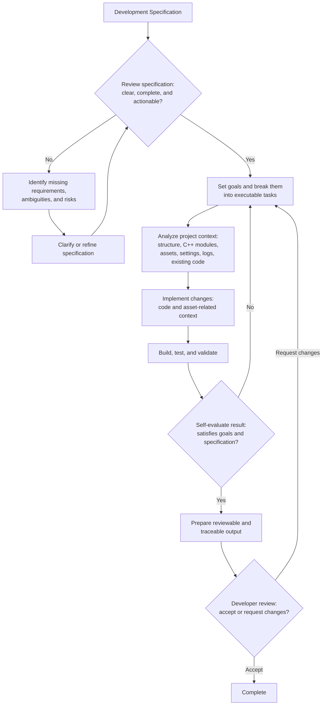

# ue-agent-toolkit

## Overview

**ue-agent-toolkit** is a toolkit for AI-agentic workflow for Unreal Engine projects.

This repository contains agent instructions, skills, specialized agents, and Unreal Engine plugins designed for game development mainly using C++.

This branch is for OpenCode users. If you use another AI agent tool, check the corresponding branch:

- [Claude Code]	(https://github.com/Tractatuz/ue-agent-toolkit/tree/main-claudecode)
- [Codex]		(https://github.com/Tractatuz/ue-agent-toolkit/tree/main-codex)

## Why ue-agent-toolkit?

Unreal Engine projects are hard to work with using general AI agent workflows because of **large engine codebase**, **long compile time**, **dependency on assets** which is not text file.

So AI agents need Unreal-specific tools and workflows on development effectively.

ue-agent-toolkit is Unreal-specific foundations for AI-agentic development.

## Project Goal

The goal of ue-agent-toolkit is to make AI agents capable of performing real development tasks in Unreal Engine projects with less human intervention.

Specifically, this project aims to :

- understand Unreal Engine project structure
- work with both code and asset-related project context
- evaluate the quality of their own work
- collaborate with developers through reviewable and traceable outputs

The long-term goal of ue-agent-toolkit is to support fully autonomous development loops for Unreal Engine projects, inspired by Ralph Loop style agent workflows.

## Expected Workflow

## Roadmap

This roadmap is not fixed and may change as the project updated.

Planned areas of development include:

- Expand Unreal-specific agent instructions for project analysis, C++ development, validation, and review
- Add reusable skills for common Unreal Engine development tasks
- Add specialized skill for test, validation, and result evaluation
- Add workflows for evaluating development specifications before implementation
- Add workflows for turning development goals into executable agent tasks
- Improve validation support for build results, test results, logs, and runtime behavior
- Improve Unreal Plugins for analyze, development, test

---
## Components

### Skills

#### ue-spec		
#### ue-plan		
#### ue-analyze	
#### ue-implement
#### ue-test		
#### ue-ralph-loop

### Agents

#### spec-reviewer
#### ue-planner
#### ue-planreviewer
#### ue-code-reader
#### ue-code-writer
#### ue-code-reviewer
#### ue-asset-reader
#### ue-asset-editor
#### ue-tester

### Unreal Engine Plugins

#### AssetToJson
#### JsonToAsset
#### TestPlay
#### TaskEvidence
